# ntfy-macos

[](https://buymeacoffee.com/laurentftech)
[](LICENSE)
[](https://www.apple.com/macos/)
[](https://swift.org/)
[](https://github.com/laurentftech/homebrew-ntfy-macos)

Receive push notifications on your Mac from any source — servers, IoT devices, home automation, CI pipelines, or custom scripts. No account required, works with the public [ntfy.sh](https://ntfy.sh) service or your own self-hosted server.

**ntfy-macos** is a native macOS client that subscribes to ntfy topics and delivers rich notifications with SF Symbols, images, and interactive buttons. Trigger shell scripts automatically when messages arrive.


## Features

- **Native macOS Notifications**: Rich notifications with SF Symbols and local images
- **Multi-Server Support**: Connect to multiple ntfy servers simultaneously
- **Emoji Tags**: Automatic conversion of ntfy tags to emojis in notification titles
- **Interactive Actions**: Add custom buttons to notifications that execute scripts or open URLs
- **Automatic Script Execution**: Run shell scripts automatically when messages arrive
- **Silent Notifications**: Receive messages without displaying notification banners
- **Secure Authentication**: Store tokens securely in macOS Keychain
- **Robust Reconnection**: Handles network interruptions and sleep/wake gracefully
- **Priority Mapping**: Maps ntfy priority levels to macOS interruption levels (critical, time-sensitive)
- **Menu Bar App**: Runs in the menu bar with quick access to config and reload
- **Live Config Reload**: Configuration changes are detected and applied automatically
- **Config Validation**: Warns about unknown keys and typos in the menu bar
- **Click to Open**: Click notifications to open in browser (configurable per topic)
- **Automatic Permission Request**: Prompts for notification permission on first launch
- **Local Notification Server**: Built-in HTTP server on localhost for scripts to trigger notifications

## Installation

### Using Homebrew

```bash
# Add the tap
brew tap laurentftech/ntfy-macos

# Install
brew install ntfy-macos
```

### Build from Source

```bash
# Clone the repository
git clone https://github.com/laurentftech/ntfy-macos.git
cd ntfy-macos

# Build the app bundle
./build-app.sh

# Install
sudo cp -r .build/release/ntfy-macos.app /Applications/
```

### Updating

```bash
# Update via Homebrew
brew update && brew upgrade ntfy-macos

# Restart the service to apply the update
brew services restart ntfy-macos
```

**Note**: Homebrew installation requires Xcode (not just Command Line Tools) because the app is built from source.

## Quick Start

1. **Initialize Configuration**

```bash
ntfy-macos init
```

This creates a sample configuration at `~/.config/ntfy-macos/config.yml`.

2. **Edit Configuration**

Edit the configuration file to add your servers and topics:

```yaml
servers:
  - url: https://ntfy.sh
    topics:
      - name: alerts
        icon_symbol: bell.fill

  - url: https://your-private-server.com
    token: tk_yourtoken
    topics:
      - name: deployments
        icon_symbol: arrow.up.circle.fill
        auto_run_script: ~/scripts/deploy-handler.sh
```

3. **(Optional) Store Authentication Token in Keychain**

```bash
ntfy-macos auth add https://ntfy.sh tk_yourtoken
```

4. **Start the Service**

```bash
# Using Homebrew services (recommended - auto-restarts on crash)
brew services start ntfy-macos

# Or run directly
ntfy-macos serve
```

On first launch, the app will automatically request notification permission.

The app runs in the menu bar with options to:
- **Server Status**: Shows connection state for each server (green=connected, red=disconnected, orange flashing=connecting)
- **Config Warning**: Displays warnings for unknown keys or typos (orange indicator)
- **Edit Config**: Open config file in your default editor
- **Show Config in Finder**: Reveal config directory
- **Reload Config**: Apply configuration changes
- **View Logs**: Open log files (with automatic rotation)
- **About**: Credits and links
- **Quit**: Stop the service

5. **(Optional) Add to Launchpad**

```bash
sudo ln -sf /usr/local/opt/ntfy-macos/ntfy-macos.app /Applications/
```

## Configuration

The configuration file is located at `~/.config/ntfy-macos/config.yml`.

For a complete list of all configuration options and detailed examples, please see the [config-examples.yml](examples/config-examples.yml) file.

### Basic Structure

```yaml
servers:
  - url: https://ntfy.sh
    topics:
      - name: alerts
        icon_symbol: bell.fill
        actions:
          - title: Open Dashboard
            type: view
            url: "https://dashboard.example.com"

  - url: https://your-private-server.com
    token: tk_yourtoken
    topics:
      - name: deployments
        icon_symbol: arrow.up.circle.fill
        auto_run_script: ~/scripts/deploy-handler.sh
```

### Configuration Options

#### Global Fields

- `local_server_port` (optional): Port for the local notification HTTP server (e.g., `9292`). Disabled if omitted.

#### Server Fields

- `url` (required): Server URL
- `token` (optional): Authentication token
- `topics` (required): List of topics

#### Topic Fields

- `name` (required): Topic name
- `icon_symbol` (optional): SF Symbol name
- `icon_path` (optional): Path to a local image file
- `auto_run_script` (optional): Script to execute on every message
- `silent` (optional): If `true`, skip notification banner
- `click_url` (optional): Custom URL to open on click
- `actions` (optional): List of interactive buttons

#### Action Fields

- `title` (required): Button label
- `type` (required): `script`, `view`, `shortcut`, or `applescript`
- `path` (for `script` and `applescript` file): Absolute path to the script file
- `url` (for `view`): URL to open
- `name` (for `shortcut`): macOS Shortcut name
- `script` (for `applescript` inline): AppleScript source code

**Note**: Config-defined actions ALWAYS override any actions sent with the ntfy message.

Here’s a summary of how actions are handled:

| Action type | ntfy protocol | ntfy-macos (payload)    | ntfy-macos (config.yml)     |
| ----------- | ------------- | ----------------------- | --------------------------- |
| view        | ✅ Standard    | ✅ Supported             | ✅ Supported                 |
| http        | ✅ Standard    | ✅ Supported             | ❌ Not supported (by design) |
| broadcast   | ✅ Standard    | ❌ Ignored (Android-only)| ❌ Not applicable            |
| script      | ❌             | ❌ Blocked               | ✅ Supported                 |
| applescript | ❌             | ❌ Blocked               | ✅ Supported                 |
| shortcut    | ❌             | ❌ Blocked               | ✅ Supported                 |

> `script`, `applescript`, and `shortcut` actions are **only available via config.yml** — they cannot be triggered from message payloads. This prevents remote code execution.

**Note:** `applescript` and `shortcut` are **ntfy-macos client-specific action types**. Only `view`, `http`, `broadcast`, and `dismiss` are part of the official ntfy protocol.

## CLI Commands

### serve

Start the notification service:

```bash
ntfy-macos serve
```

### auth

Manage authentication tokens in Keychain:

```bash
# Add a token
ntfy-macos auth add <server-url> <token>

# List all stored tokens
ntfy-macos auth list

# Remove a token
ntfy-macos auth remove <server-url>
```

Keychain tokens take priority over tokens in the YAML configuration.

### test-notify

Send a test notification (and request permissions):

```bash
ntfy-macos test-notify --topic <NAME>
```

### init

Create a sample configuration file:

```bash
ntfy-macos init
```

### help

Display help information:

```bash
ntfy-macos help
```

## Script Execution

Scripts receive the message body as the first argument (`$1`) and full message context as environment variables:

```bash
#!/bin/bash
MESSAGE="$1"

# Environment variables available:
# NTFY_ID       - Unique message ID
# NTFY_TOPIC    - Topic name
# NTFY_TIME     - Unix timestamp
# NTFY_EVENT    - Event type (always "message")
# NTFY_TITLE    - Message title (if set)
# NTFY_MESSAGE  - Message body (if set)
# NTFY_PRIORITY - Priority level 1-5 (if set)
# NTFY_TAGS     - Comma-separated tags (if set)
# NTFY_CLICK    - Click URL (if set)

echo "[$NTFY_TOPIC] $NTFY_TITLE: $MESSAGE"
# Your automation logic here
```

### Environment

Scripts are executed with an enhanced PATH:
```
/opt/homebrew/bin:/usr/local/bin:/usr/bin:/bin:/usr/sbin:/sbin
```

This ensures Homebrew-installed tools are available.

### Make Scripts Executable

```bash
chmod +x /path/to/your/script.sh
```

### Security Considerations

Scripts are **only executed if explicitly configured** in your local `config.yml` file. ntfy-macos will never execute arbitrary code from incoming messages.

**Best practices:**
- Only configure scripts that you trust and have reviewed
- Use absolute paths to scripts
- For public topics, avoid `auto_run_script`
- Keep your configuration file secure (`chmod 600 ~/.config/ntfy-macos/config.yml`)
- For sensitive automation, use a self-hosted ntfy server with authentication
- Use `allowed_schemes` and `allowed_domains` to restrict which URLs can be opened.

## Local Notification Server

ntfy-macos can run a local HTTP server on localhost that allows scripts and local tools to trigger macOS notifications directly, without going through an external ntfy server.

```mermaid
flowchart LR
    subgraph External
        ntfy["🌐 ntfy server"]
        cron["⏰ cron / launchd"]
        ci["🔧 CI pipeline"]
    end

    subgraph ntfy-macos
        client["📡 ntfy client"]
        script["📜 auto_run_script"]
        local["🖥️ Local HTTP server
        127.0.0.1:9292"]
        notif["🔔 macOS notification"]
    end

    ntfy -- "subscribe" --> client
    client -- "show notification" --> notif
    client -- "run script + NTFY_* env" --> script
    script -- "POST /notify" --> local
    local -- "follow-up" --> notif

    cron -- "POST /notify" --> local
    ci -- "POST /notify" --> local

    style ntfy fill:#4a90d9,stroke:#2c5f8a,color:#fff
    style cron fill:#6c757d,stroke:#495057,color:#fff
    style ci fill:#6c757d,stroke:#495057,color:#fff
    style client fill:#28a745,stroke:#1e7e34,color:#fff
    style script fill:#ffc107,stroke:#d39e00,color:#000
    style local fill:#17a2b8,stroke:#117a8b,color:#fff
    style notif fill:#e83e8c,stroke:#c21c6b,color:#fff
```



### Setup

Add `local_server_port` to the root of your `config.yml`:

```yaml
local_server_port: 9292

servers:
  - url: https://ntfy.sh
    topics:
      - name: alerts
```

### Usage

Send a POST request to trigger a notification:

```bash
curl -X POST http://127.0.0.1:9292/notify \
  -H "Content-Type: application/json" \
  -d '{"title": "Build Complete", "message": "Project compiled successfully", "priority": 3, "tags": ["white_check_mark"]}'
```

### API

**POST /notify**

| Field      | Type     | Required | Description                              |
|------------|----------|----------|------------------------------------------|
| `title`    | string   | Yes      | Notification title                       |
| `message`  | string   | Yes      | Notification body                        |
| `priority` | integer  | No       | Priority 1-5 (maps to macOS levels)      |
| `tags`     | string[] | No       | Emoji tags (e.g., `["warning", "fire"]`) |

**GET /health** - Returns `{"status": "ok"}` for health checks.

### Example: Auto-run Script with Local Notifications

Combine `auto_run_script` with the local server to create rich feedback loops:

```bash
#!/bin/bash
# auto_run_script for topic "deployments"
# Receives message via $1 and env vars, then triggers a local follow-up notification

RESULT=$(deploy.sh "$NTFY_MESSAGE" 2>&1)
EXIT_CODE=$?

if [ $EXIT_CODE -eq 0 ]; then
  curl -s -X POST http://127.0.0.1:9292/notify \
    -d "{\"title\": \"Deploy Success\", \"message\": \"$NTFY_MESSAGE deployed successfully\", \"tags\": [\"white_check_mark\"]}"
else
  curl -s -X POST http://127.0.0.1:9292/notify \
    -d "{\"title\": \"Deploy Failed\", \"message\": \"$RESULT\", \"priority\": 4, \"tags\": [\"x\"]}"
fi
```

### Security

- Binds to `127.0.0.1` only (not accessible from the network)
- Maximum request body size: 4 KB
- No code execution - only triggers notifications
- Disabled by default (requires `local_server_port` in config)

## Priority Mapping

ntfy priority levels map to macOS interruption levels:

- Priority 5 → Critical (bypasses Focus modes)
- Priority 4 → Time Sensitive (prominently displayed)
- Priority 1-3 → Active (normal notifications)

## SF Symbols

You can use any SF Symbol name for icons. Browse all symbols using the SF Symbols app (free from Apple).

## Markdown Messages

macOS native notifications only support plain text and cannot render formatted markdown. ntfy-macos automatically strips markdown syntax from messages for cleaner display.

## Emoji Tags

ntfy supports [emoji shortcodes](https://docs.ntfy.sh/emojis/) in the `Tags` field. These are automatically converted to emojis and prepended to the notification title.

Example: `Tags: warning,fire` → **⚠️🔥 Alert**

## FAQ

### Why don't notifications appear?

- **Focus Mode**: Check if Focus/Do Not Disturb is enabled.
- **Permissions**: Go to System Settings → Notifications → ntfy-macos and ensure notifications are allowed.
- **Background execution**: If launched via `brew services`, ensure the app has permission to run in the background.

### Permission dialog doesn't respond to clicks

If the permission dialog is unresponsive:

1. Stop the service: `brew services stop ntfy-macos`
2. Grant permission manually: System Settings → Notifications → ntfy-macos → Allow Notifications
3. Restart the service: `brew services start ntfy-macos`

## Troubleshooting

- **Logs**: `~/.local/share/ntfy-macos/logs/ntfy-macos.log`
- **Test Notifications**: `ntfy-macos test-notify --topic test`
- **Connection Issues**: Verify server URL and token.
- **Script Not Executing**: Ensure the script is executable (`chmod +x`).

## Architecture

- **Swift 6**: Modern Swift with strict concurrency
- **URLSession**: Native streaming JSON support
- **UserNotifications**: Rich macOS notifications
- **Security Framework**: Keychain integration
- **Yams**: YAML parsing
- **Foundation & AppKit**: Core macOS frameworks

## Contributing

Contributions are welcome! Please open issues or pull requests on GitHub.

## License

MIT License

## Credits

This project is a third-party client for [ntfy](https://ntfy.sh), created by [Philipp C. Heckel](https://github.com/binwiederhier).

## Related Projects

- [ntfy](https://ntfy.sh) - Simple pub-sub notification service
- [ntfy-android](https://github.com/binwiederhier/ntfy-android) - Official Android app
- [ntfy-ios](https://github.com/binwiederhier/ntfy-ios) - Official iOS app

## Support

For bugs and feature requests, please open an issue on GitHub.
